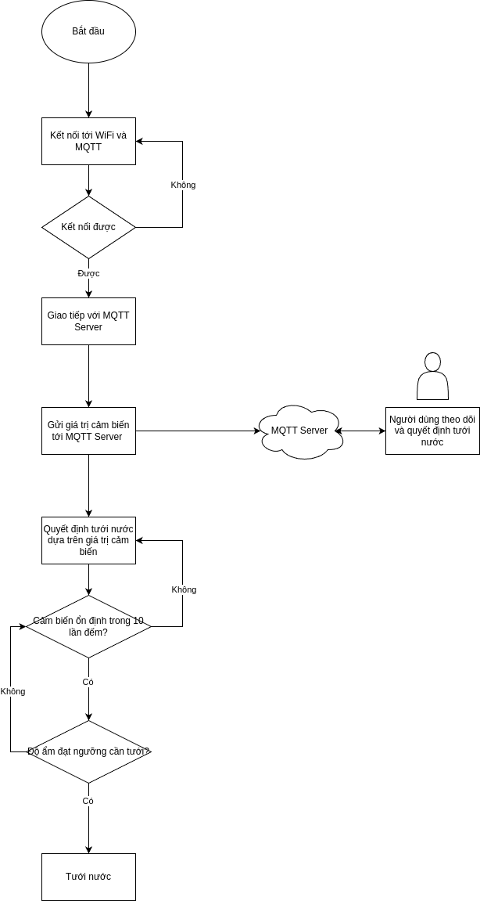
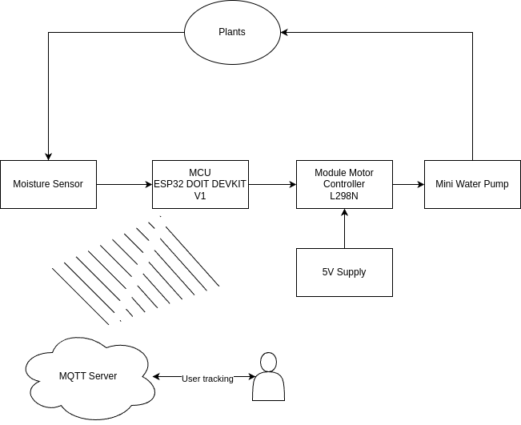
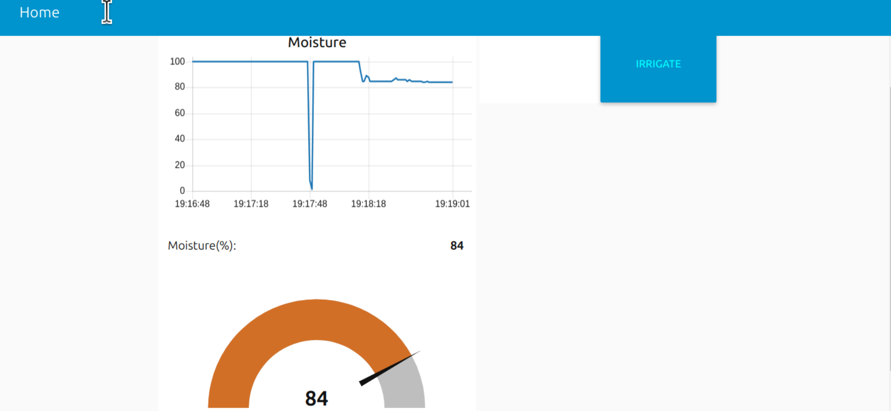
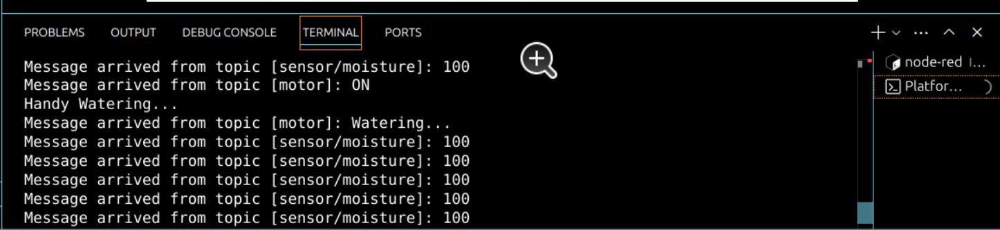
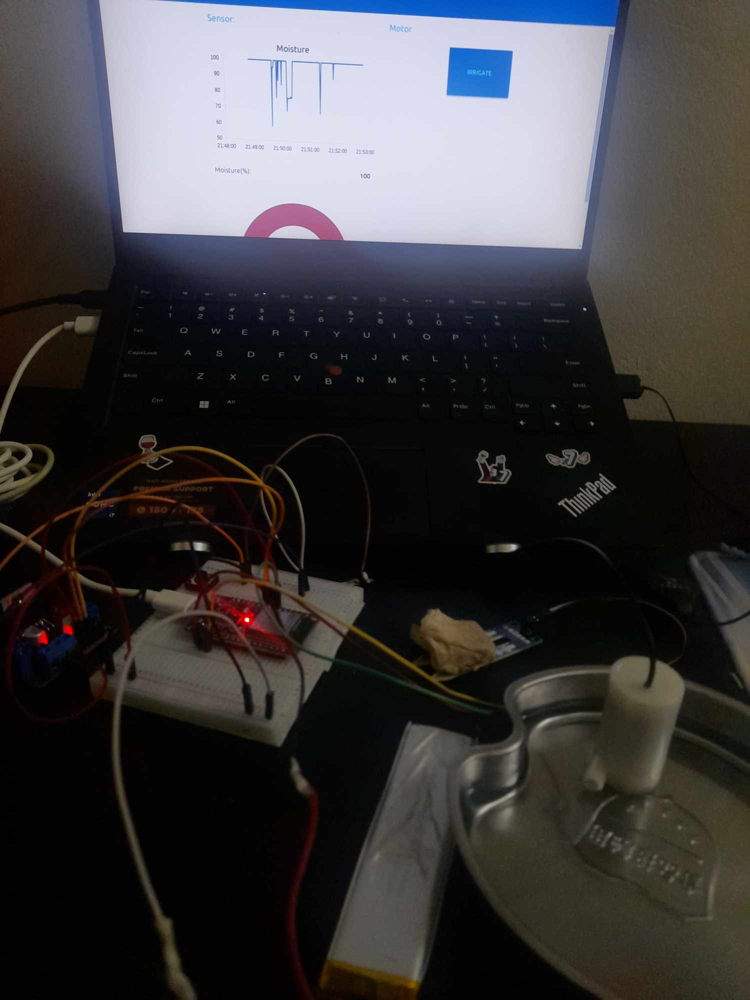

# Hệ Thống Tưới Tiêu Tự Động  

## 1. Đặt Vấn Đề  
Nhu cầu tưới tiêu đúng lúc và đúng lượng là một trong những yếu tố quan trọng để đảm bảo sự phát triển của cây trồng. Tuy nhiên, việc tưới tiêu thủ công thường tốn thời gian và công sức, chưa kể có thể dẫn đến tình trạng lãng phí nước hoặc thiếu nước. Do đó, việc xây dựng một hệ thống tưới tiêu tự động là giải pháp thiết yếu, giúp tối ưu hóa việc sử dụng nước và tiết kiệm thời gian cho người làm nông nghiệp.

## 2. Cơ Sở  
Hệ thống dựa trên các cảm biến để đo lường độ ẩm đất và điều khiển các thiết bị tưới tiêu thông qua một bộ điều khiển trung tâm. MQTT được sử dụng làm giao thức truyền thông, giúp việc điều khiển từ xa và giám sát trạng thái hoạt động trở nên hiệu quả. ESP32 DOIT Devkit V1, với khả năng kết nối Wi-Fi và hỗ trợ nhiều giao thức, đóng vai trò trung tâm trong hệ thống này.

## 3. Mục Đích  
- Tự động hóa việc tưới tiêu dựa trên mức độ ẩm của đất.  
- Tối ưu hóa việc sử dụng nước, giảm lãng phí.  
- Cho phép điều khiển và giám sát từ xa thông qua ứng dụng MQTT.  
- Hỗ trợ mở rộng và tích hợp với các hệ thống IoT khác trong nông nghiệp thông minh.

## 4. Hướng Phát Triển Lâu Dài
- Tích hợp ứng dụng trên điện thoại để điều khiển và giám sát trực quan hơn.  
- Mở rộng hệ thống để quản lý nhiều khu vực tưới tiêu.  
- Thêm các cảm biến như nhiệt độ, ánh sáng để cải thiện khả năng phân tích môi trường.  
- Sử dụng năng lượng mặt trời để cung cấp nguồn điện, hướng đến giải pháp thân thiện với môi trường.

## 5. Linh Kiện Sử Dụng  
| Linh Kiện               | Mô Tả                                                             |
|-------------------------|-------------------------------------------------------------------|
| **ESP32 DOIT Devkit V1** | MCU kết nối Wi-Fi và chạy các thuật toán điều khiển. |
| **L298N Motor Driver**   | Điều khiển bơm nước mini.                                        |
| **Mini Water Pump**      | Dùng để bơm nước.                                               |
| **Cảm biến độ ẩm đất**   | Đo lường mức độ ẩm trong đất.                                   |
| **Nguồn pin 5V**         | Cung cấp nguồn điện cho các linh kiện.                         |
| **MQTT**                 | Giao thức truyền thông để điều khiển và nhận dữ liệu từ xa.    |

## 6. Thực Nghiệm  

### 6.1 Quy Trình Thực Nghiệm  
1. **Lắp Đặt**: Kết nối các linh kiện theo sơ đồ. ESP32 được lập trình để đọc dữ liệu từ cảm biến độ ẩm đất và điều khiển motor driver L298N.
  
3. **Cấu Hình MQTT**: ESP32 kết nối Wi-Fi và giao tiếp với MQTT broker để nhận lệnh hoặc gửi dữ liệu.
   
5. **Kiểm Tra Hoạt Động**: 
   - Đưa cảm biến vào đất có độ ẩm khác nhau để kiểm tra khả năng phản hồi của hệ thống.  
   - Điều khiển bơm nước từ xa qua MQTT để đảm bảo sự tương tác chính xác.  
6. **Đo Lường Hiệu Quả**: Theo dõi mức độ tiết kiệm nước và tính chính xác trong việc tưới tiêu.

### 6.2 Kết Quả Thử Nghiệm  
- Hệ thống hoạt động ổn định, kích hoạt bơm nước khi độ ẩm đất giảm xuống dưới ngưỡng thiết lập.  
- Khả năng giám sát và điều khiển từ xa qua MQTT được đánh giá hiệu quả.  
- Mức tiêu thụ điện và nước đều giảm đáng kể so với phương pháp thủ công.  

## 7. Kết Luận  
Hệ thống tưới tiêu tự động mang lại nhiều lợi ích thiết thực trong việc tối ưu hóa tài nguyên và công sức lao động. Bước tiếp theo, hệ thống có thể được cải tiến để phục vụ các mục tiêu dài hạn trong nông nghiệp thông minh.

---

